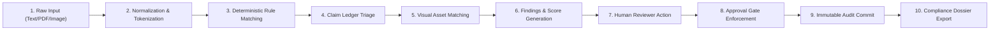

# 47 — DATA FLOW AND PROCESSING PIPELINES
**Platform:** BRANDTRACE
**Status:** **VERIFIED IMPLEMENTED**

---

```mermaid
flowchart LR
    Input["1. Raw Input (Text/PDF/Image)"] --> Norm["2. Normalization & Tokenization"]
    Norm --> Det["3. Deterministic Rule Matching"]
    Det --> Claim["4. Claim Ledger Triage"]
    Claim --> Visual["5. Visual Asset Matching"]
    Visual --> Findings["6. Findings & Score Generation"]
    Findings --> Review["7. Human Reviewer Action"]
    Review --> Gate["8. Approval Gate Enforcement"]
    Gate --> Audit["9. Immutable Audit Commit"]
    Audit --> Dossier["10. Compliance Dossier Export"]
```
